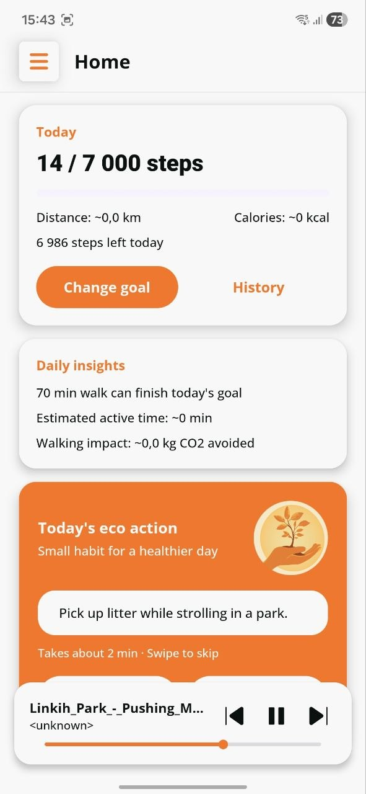
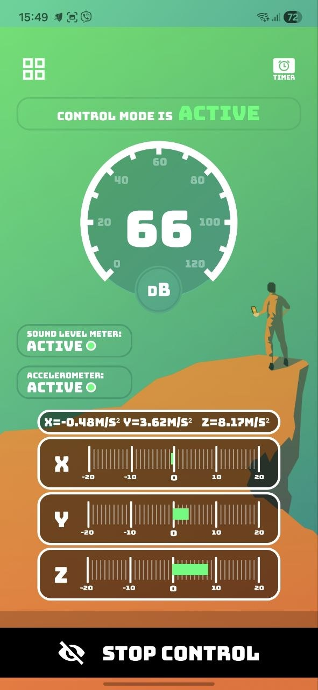
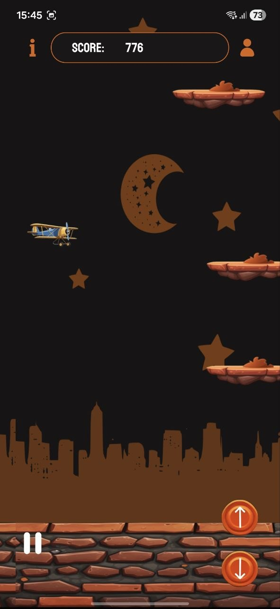
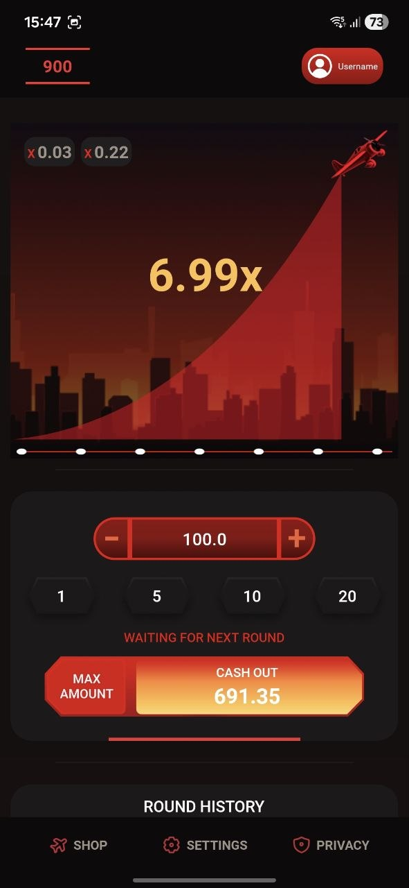
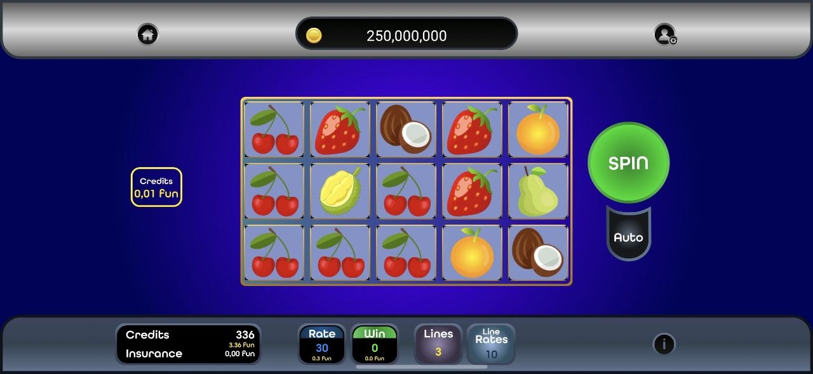
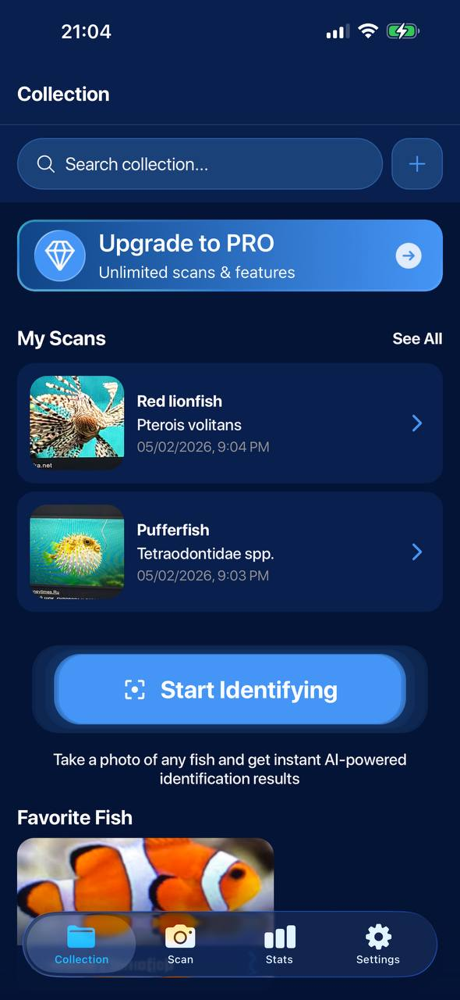
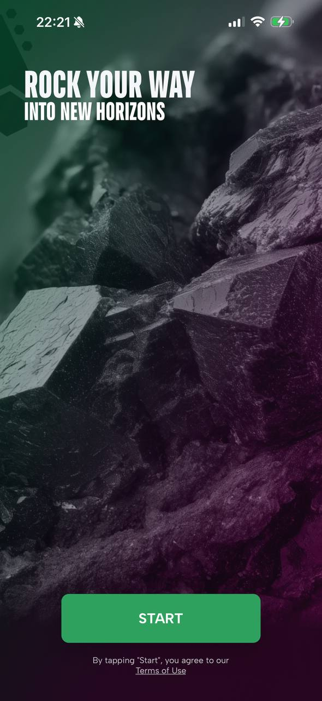
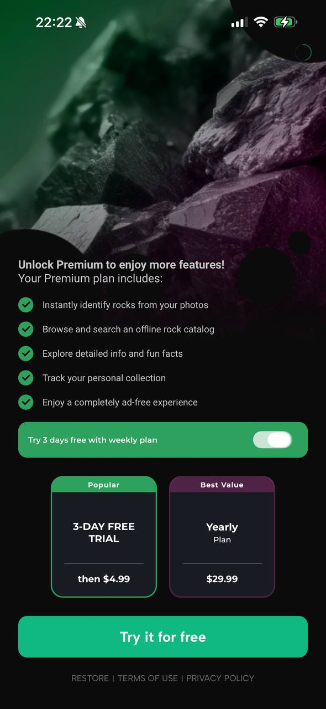
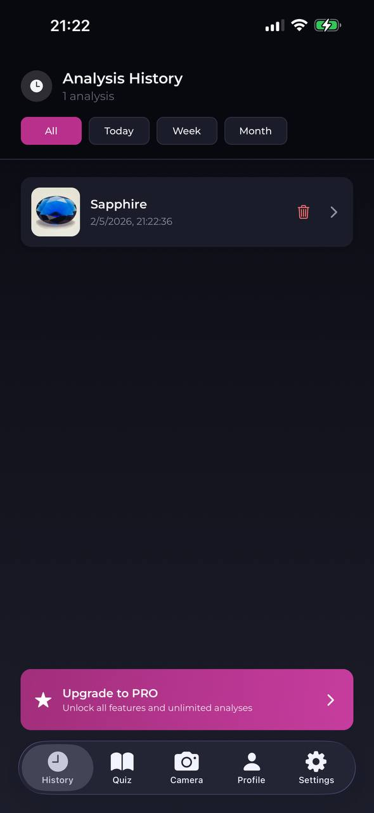

# Sergey Kosarevskiy

**Middle Android Developer | Kotlin | Jetpack Compose | Clean Architecture**

Android-first mobile developer with **3.5+ years of commercial experience** building production apps from scratch: utilities, lifestyle apps, sensor-based tools, and lightweight games. I also have React Native experience with AI-powered subscription apps published on the App Store.

My main focus is Android development with Kotlin, Jetpack Compose, MVVM/Clean Architecture, Coroutines/Flow, Room, Firebase, background services, sensors, and polished mobile UX.

## What I Build

- Android apps with clear architecture, readable code, and maintainable feature structure
- Background features: Foreground Services, reboot recovery, notifications, timers, MediaSession
- Sensor-based apps using accelerometer, microphone, step counter, and device state
- Game mechanics: reels, betting rounds, collision logic, progression, persistence
- AI and subscription flows from React Native experience: GPT API, RevenueCat, AppsFlyer, Firebase Remote Config, A/B testing

## Tech Stack

**Android:** Kotlin, Jetpack Compose, Android SDK, MVVM, Clean Architecture, Coroutines, Flow, Room, Retrofit, Firebase, Services, Sensors, MediaSession

**React Native:** React Native, TypeScript, GPT API, RevenueCat, AppsFlyer, Firebase Remote Config

**Tools:** Git, GitHub, Android Studio, Gradle, Cursor AI

## Featured Android Projects

These repositories are being prepared as portfolio projects with screenshots, architecture notes, implementation details, and demo media.

<table>
  <tr>
    <td valign="top" width="50%" >
      
      <h3>Sustain Step</h3>
      
Fitness and step tracking app with background monitoring, daily goals, history, statistics, and music playback controls.

      
<strong>Stack:</strong> Kotlin, MVVM, Coroutines/Flow, Room, Services, MediaSession

      
<a href="https://github.com/Sergey-mobiledev/sustain-step">Repository</a>

       
    </td>
    <td valign="top">
      
      <h3>FallControl</h3>
      
Real-time fall detection app combining accelerometer and microphone events while monitoring runs in the background.

      
<strong>Stack:</strong> Kotlin, MVVM, Coroutines/Flow, Room, Sensors, Foreground Service

      
<a href="https://github.com/Sergey-mobiledev/fall-control">Repository</a>

       
    </td>
  </tr>
  </table>

<table cellpadding="0" cellspacing="0">
  <tr>
    <td valign="top" width="50%">
      
      <h3>Sky Bet Crash</h3>
      
Arcade crash game with plane movement logic, obstacle avoidance, collision detection, levels, and saved progress.

      
<strong>Stack:</strong> Kotlin, Android SDK, custom game logic, local persistence

      
<a href="https://github.com/Sergey-mobiledev/sky-bet-crash">Repository</a>

       
    </td>
    <td valign="top">
      
      <h3>Aviator Slots</h3>
      
Crash-style game prototype with betting flow, rising multiplier, round mechanics, cash-out behavior, and balance management.

      
<strong>Stack:</strong> Kotlin, Android SDK, MVVM, local persistence

      
<a href="https://github.com/Sergey-mobiledev/aviator-slots">Repository</a>

       
    </td>
  </tr>
</table>

<table>
  <tr>
    <td valign="top" width="53%">
       
      
    </td>
    <td valign="top" width="47%">
      
<strong>Fruit Party</strong>

      
Slot-style Android game with a complete gameplay loop: reels, configurable bet lines, win calculation, bonus mini-game, user profile, and data sync.

      
<strong>Highlights:</strong> game state management, configurable rules, local persistence, remote sync, reusable UI components.

      
<strong>Stack:</strong> Kotlin, Android SDK, MVVM, Room, Retrofit, Firebase

      
<a href="https://github.com/Sergey-mobiledev/fruit-party">Repository</a>

    </td>
  </tr>
</table>

## Published React Native Work

Commercial source code is private, but these apps show my experience with production mobile flows outside Android native development.

### FishSnap

AI-powered fish identification app with subscription monetization.

- App Store: [FishSnap](https://apps.apple.com/app/fishsnap/id6757752075)
- Built with React Native, TypeScript, GPT API, RevenueCat, AppsFlyer, Firebase Remote Config
- Implemented AI recognition flow, onboarding, paywalls, streaming results, and subscription logic

<table cellpadding="20" cellspacing="20">
  <tr>
    <td valign="top" width="33%">
      
    </td>
    <td valign="center" width="33%">
      
    </td>
    <td valign="top" width="33%">
      
    </td>
  </tr>
</table>

### RockAI

AI-powered rock identification app with GPT-based analysis and subscription monetization.

- App Store: [RockAI](https://apps.apple.com/app/rockai/id6754770668)
- Built with React Native, TypeScript, GPT API, RevenueCat, AppsFlyer, Firebase Remote Config
- Worked on AI result generation, configurable monetization flows, onboarding, and app architecture

<table cellpadding="20" cellspacing="20">
  <tr>
    <td valign="top" width="33%">
      
    </td>
    <td valign="top" width="33%">
      
    </td>
    <td valign="top" width="33%">
      
    </td>
  </tr>
</table>

- Email: [sergeykosarevskiy@gmail.com](mailto:sergeykosarevskiy@gmail.com)
- GitHub: [Sergey-mobiledev](https://github.com/Sergey-mobiledev)
- LinkedIn: [sergey-kosarevskiy](https://www.linkedin.com/in/sergey-kosarevskiy-214942229/)
- Telegram: [@sergey_mobiledev](https://t.me/sergey_mobiledev)
